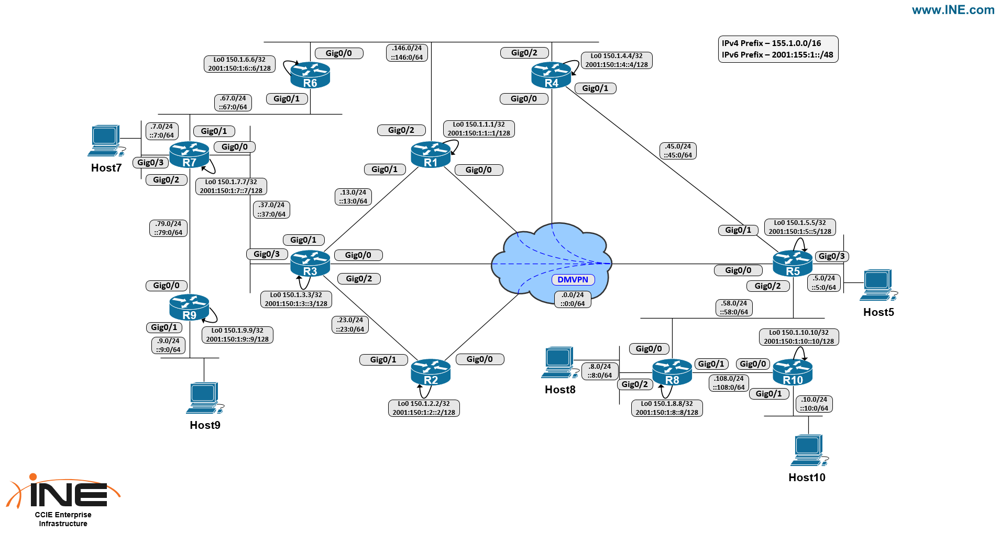

Task

- R5, R7, R8, R9, and R10 are pre-configured as DHCP servers for their attached hosts. Request a DHCP lease with the udhcpc CLI command on the end hosts, and verify ICMP connectivity to its attached router.
- Enable EIGRP AS 1 on all routers in the topology for networks 155.1.0.0/16 and 150.1.0.0/16. Once complete you should have full IPv4 reachability throughout the network.
  - Configure Policy-Based Routing on R5 as follows:
  -Traffic from Host8 and Host10’s subnets to Host9’s subnet should forward over the DMVPN towards R3. Return flows should route dynamically.
  - Telnet, SSH, HTTP, and HTTPS traffic from Host5’s subnet to Host7’s subnet should forward over the DMVPN towards R1. Return flows should route dynamically.
  - If R5 is unable to reach R1 and/or R3 with an ICMP PING within 5 seconds, it should fallback to normal forwarding.

Solutions

```
R1 - R10:
router eigrp 1
 network 150.1.0.0
 network 155.1.0.0

R5:
router eigrp 1
 network 150.1.0.0
 network 155.1.0.0
!
track 1 ip sla 1 reachability
track 2 ip sla 2 reachability
ip sla 1
 icmp-echo 155.1.0.1
 frequency 5
ip sla schedule 1 life forever start-time now
ip sla 2
 icmp-echo 155.1.0.3
 frequency 5
ip sla schedule 2 life forever start-time now
!
ip access-list extended H5-PBR
 permit ip 155.1.5.0 0.0.0.255 155.1.7.0 0.0.0.255 dscp af11
!
ip access-list extended HOST8-HOST10-SUBNETS-TO-HOST9
 permit ip 155.1.8.0 0.0.0.255 155.1.9.0 0.0.0.255
 permit ip 155.1.10.0 0.0.0.255 155.1.9.0 0.0.0.255
!
class-map match-any H5-INTERESTING-TRAFFIC
 match application telnet
 match application ssh
 match application http
 match application https
!
policy-map H5-MARK-INTERESTING
 class H5-INTERESTING-TRAFFIC
  set ip dscp af11
!
route-map HOST5-PBR permit 10
 match ip address H5-PBR
 match track  1
 set ip next-hop 155.1.0.1
!
route-map HOST8-HOST10-PBR permit 10
 match ip address HOST8-HOST10-SUBNETS-TO-HOST9
 match track  2
 set ip next-hop 155.1.0.3
!
interface GigabitEthernet0/2
 ip policy route-map HOST8-HOST10-PBR
!
interface GigabitEthernet0/3
 ip policy route-map HOST5-PBR
 service-policy input H5-MARK-INTERESTING
```