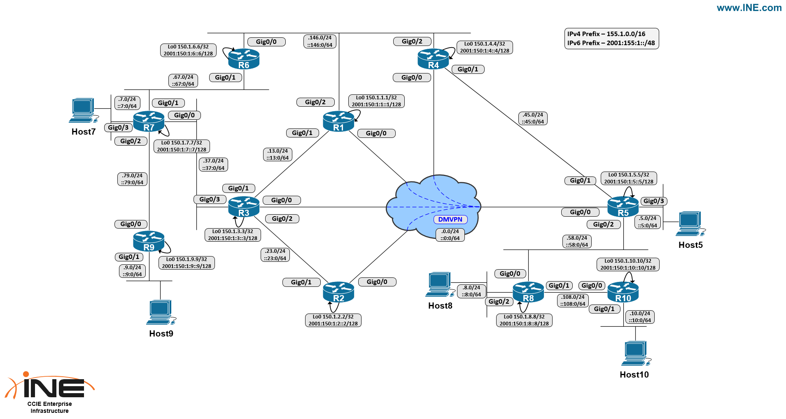

Task

- R5 is pre-configured as a DHCP server for Host5. Request a DHCP lease with the udhcpc CLI command on Host5, and it should be assigned the address 155.1.5.100/24.
- R4 and R5 are connected through the DMVPN over public transport, and through a point-to-point Metro Ethernet connection.
- Using static routing, configure the network so that traffic between Host5 and the 155.1.146.0/24 subnet prefers to route over the DMVPN.
- If reachability is lost between R4 and R5 over the DMVPN, the should failover to the Metro-E circuit as a backup.
- To track the DMVPN, R4 and R5 should ping each other every 1000ms, and failover if ICMP reachability is lost.

Bonus Task
- Enable IPv6 routing on the DMVPN between R4 and R5.
- Similar to the previous exercise, configure static IPv6 routing so that traffic between Host5 and the 2001:155:1:146::/64 network prefers to forward over the DMVPN, but will failover to the point-to-point Ethernet circuit if ICMPv6 reachability over DMVPN is lost.

Solutions:
```
R4:
ip sla 1
 icmp-echo 155.1.0.5 source-ip 155.1.0.4
 threshold 500
 timeout 500
 frequency 1
!
ip sla schedule 1 life forever start-time now
!
track 1 ip sla 1 reachability
!
ip route 155.1.5.0 255.255.255.0 155.1.0.5 track 1
ip route 155.1.5.0 255.255.255.0 155.1.45.5 10
!
ipv6 unicast-routing
!
interface Tunnel0
 ipv6 address FE80::4 link-local
 ipv6 address 2001:155:1::4/64
 ipv6 nhrp authentication NHRPPASS
 ipv6 nhrp network-id 1
 ipv6 nhrp nhs 2001:155:1::5 nbma 169.254.100.5 multicast
!
ip sla 2
 icmp-echo 2001:155:1::5 source-ip 2001:155:1::4
 threshold 500
 timeout 500
 frequency 1
!
ip sla schedule 2 life forever start-time now
!
track 2 ip sla 2 reachability
!
ipv6 route 2001:155:1:5::/64 2001:155:1::5 track 2
ipv6 route 2001:155:1:5::/64 2001:155:1:45::5 10

R5:
ip sla 1
 icmp-echo 155.1.0.4 source-ip 155.1.0.5
 threshold 500
 timeout 500
 frequency 1
!
ip sla schedule 1 life forever start-time now
!
track 1 ip sla 1 reachability
!
ip route 155.1.146.0 255.255.255.0 155.1.0.4 track 1
ip route 155.1.146.0 255.255.255.0 155.1.45.4 10
!
ipv6 unicast-routing
!
interface Tunnel0
 ipv6 address FE80::5 link-local
 ipv6 address 2001:155:1::5/64
 ipv6 nhrp authentication NHRPPASS
 ipv6 nhrp network-id 1
!
ip sla 2
 icmp-echo 2001:155:1::4 source-ip 2001:155:1::5
 threshold 500
 timeout 500
 frequency 1
!
ip sla schedule 2 life forever start-time now
!
track 2 ip sla 2 reachability
!
ipv6 route 2001:155:1:146::/64 2001:155:1::4 track 2
ipv6 route 2001:155:1:146::/64 2001:155:1:45::4 10
```